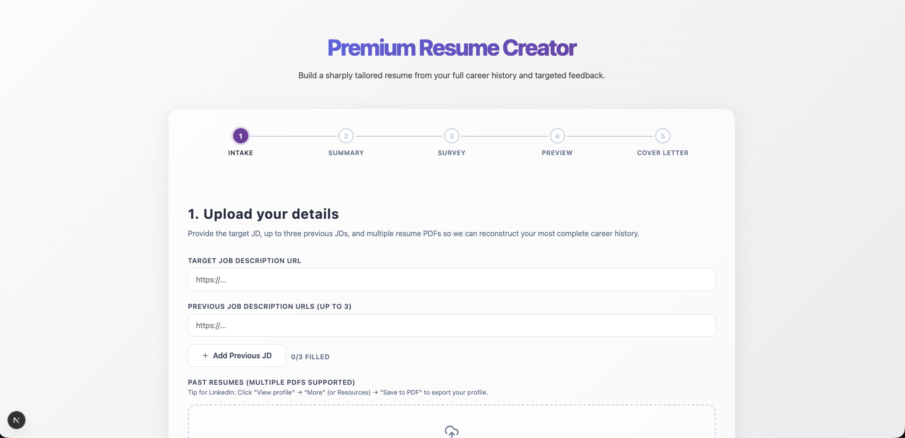
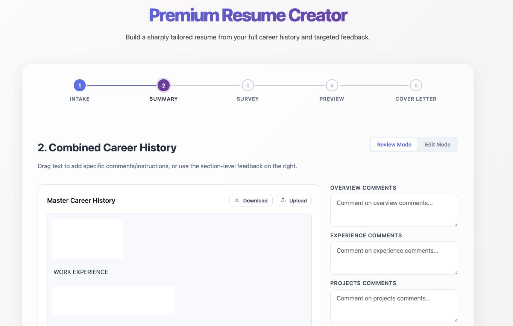
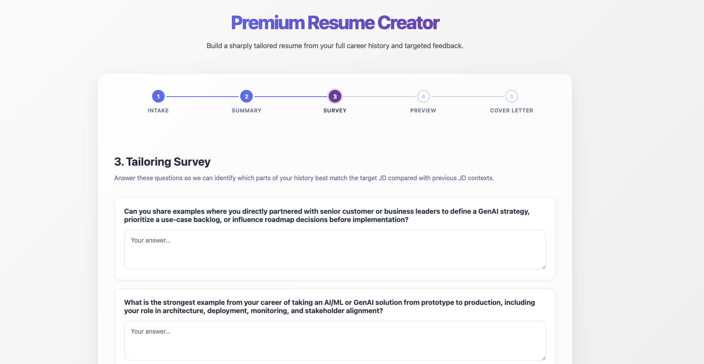
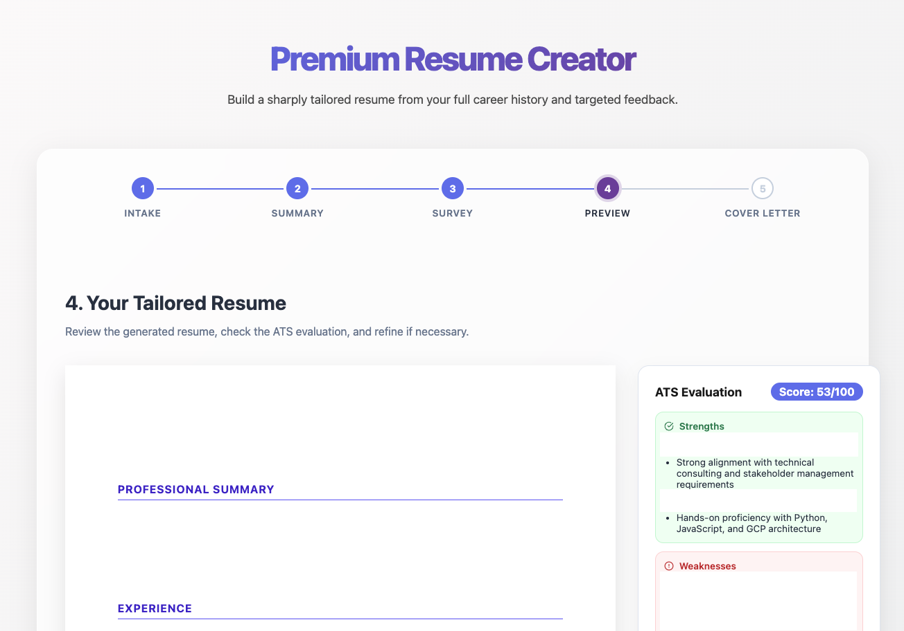

# ✨ Resume Creator AI ✨

> **Build a sharply tailored resume from your full career history and targeted feedback.**

A premium, stateless AI-powered platform for browser-first resume generation. This backend orchestrates high-context LLM workflows and deterministic ATS scoring to help candidates land more interviews.

## Features

- `POST /analyze` to structure resume text and analyze the target job description
- `POST /generate` to produce a one-page tailored resume draft
- `POST /evaluate` to calculate ATS score and provide hiring-manager feedback
- `POST /cover-letter` to generate an optional tailored cover letter
- `POST /generate/stream` and `POST /cover-letter/stream` for SSE-based progressive delivery
- `GET /capabilities` so the frontend can detect provider/model/streaming support at runtime
- **Multi-Provider Support**: Pluggable architecture supporting Vertex AI (Gemini), OpenAI, and Anthropic (Claude) through a shared LLM client
- Best-effort in-memory TTL caching and retry logic for transient LLM failures

## Core Workflow

Experience a seamless, multi-step resume tailoring process designed for maximum ATS alignment and hiring manager appeal.

### 1. Intake Phase


### 2. Career History Refinement


### 3. Tailoring Survey


### 4. Preview & Analysis


1. **Intake Phase**: Upload your target JD and multiple resume PDFs.
2. **Career History**: Reconstruct and refine your deduplicated master career history.
3. **Tailoring Survey**: Answer AI-generated questions to bridge the gap between your history and the target role.
4. **Preview & Analysis**: Review your tailored resume alongside real-time ATS scoring and hiring manager insights.

## Project Layout

```text
app/
components/
backend/
lib/
  main.py
  routers/
  prompts/
  schemas/
  services/
  tests/
```

## Local Setup

1. Create a virtual environment:

```bash
python3 -m venv .venv
source .venv/bin/activate
```

2. Install dependencies:

```bash
pip install -r requirements.txt
```

3. Configure environment variables:

```bash
cp .env.sample .env
```

4. Start the API:

```bash
uvicorn backend.main:app --reload
```

or:

```bash
./scripts/dev.sh
```

Common commands:

```bash
make dev
make test
make lint-check
make ci
```

5. Install frontend dependencies:

```bash
npm install
```

6. Start the frontend:

```bash
npm run dev
```

## Environment Variables

| Variable | Purpose |
| --- | --- |
| `DEFAULT_LLM_PROVIDER` | `openai`, `vertex`, or `anthropic` |
| `HOST` | Bind host for the API server |
| `PORT` | Bind port for the API server |
| `LOG_LEVEL` | Uvicorn log level |
| `UVICORN_WORKERS` | Worker count for production startup |
| `OPENAI_API_KEY` | OpenAI API key when using OpenAI |
| `OPENAI_MODEL` | OpenAI model name |
| `ANTHROPIC_API_KEY` | Anthropic API key when using Anthropic |
| `ANTHROPIC_MODEL` | Anthropic model name |
| `VERTEX_PROJECT` | GCP project id for Vertex |
| `VERTEX_LOCATION` | GCP region for Vertex |
| `VERTEX_MODEL` | Vertex model name |
| `LLM_MAX_RETRIES` | Retry count for transient LLM failures |
| `ENABLE_IN_MEMORY_CACHE` | Enables process-local TTL cache |
| `CACHE_TTL_SECONDS` | Cache TTL in seconds |
| `CORS_ORIGINS` | Comma-separated allowed origins |
| `NEXT_PUBLIC_API_BASE_URL` | Frontend base URL for the FastAPI backend |

## API Examples

### `POST /analyze`

```bash
curl -X POST http://127.0.0.1:8000/analyze \
  -H "Content-Type: application/json" \
  -d '{
    "job_description": "We are hiring a Python backend engineer with FastAPI and ATS optimization experience.",
    "resume_text": "Built Python APIs, improved resume workflows, and delivered recruiter-facing tools.",
    "github_summary": "Maintains OSS Python projects and API tooling."
  }'
```

Example response:

```json
{
  "jd_analysis": {
    "must_have_skills": ["python", "fastapi"],
    "nice_to_have": ["llamaindex"],
    "keywords": ["python", "fastapi", "ats"],
    "role_summary": "Backend AI engineer focused on resume and recruiter tooling."
  },
  "resume_structured": {
    "summary": "AI engineer with backend product experience.",
    "experience": [],
    "skills": ["Python", "FastAPI"],
    "projects": [],
    "education": []
  }
}
```

### `POST /generate`

```bash
curl -X POST http://127.0.0.1:8000/generate \
  -H "Content-Type: application/json" \
  -d '{
    "jd_analysis": {
      "must_have_skills": ["python", "fastapi"],
      "nice_to_have": ["llamaindex"],
      "keywords": ["python", "fastapi", "ats"],
      "role_summary": "Backend AI engineer focused on resume tooling."
    },
    "resume_structured": {
      "summary": "AI engineer with backend product experience.",
      "experience": [],
      "skills": ["Python", "FastAPI"],
      "projects": [],
      "education": []
    }
  }'
```

### `POST /evaluate`

```bash
curl -X POST http://127.0.0.1:8000/evaluate \
  -H "Content-Type: application/json" \
  -d '{
    "resume": "Built Python FastAPI services for resume analysis and recruiter workflows.",
    "jd_analysis": {
      "must_have_skills": ["python", "fastapi"],
      "nice_to_have": ["llamaindex"],
      "keywords": ["python", "fastapi", "ats"],
      "role_summary": "Backend AI engineer focused on resume tooling."
    }
  }'
```

### `POST /cover-letter`

```bash
curl -X POST http://127.0.0.1:8000/cover-letter \
  -H "Content-Type: application/json" \
  -d '{
    "resume": "Built Python FastAPI services for resume analysis.",
    "job_description": "Hiring a backend engineer for AI recruiting tools.",
    "user_notes": "Mention recruiter workflows and practical product ownership."
  }'
```

### `POST /generate/stream`

```bash
curl -N -X POST http://127.0.0.1:8000/generate/stream \
  -H "Content-Type: application/json" \
  -H "Accept: text/event-stream" \
  -d '{
    "jd_analysis": {
      "must_have_skills": ["python", "fastapi"],
      "nice_to_have": ["llamaindex"],
      "keywords": ["python", "fastapi", "ats"],
      "role_summary": "Backend AI engineer focused on resume tooling."
    },
    "resume_structured": {
      "summary": "AI engineer with backend product experience.",
      "experience": [],
      "skills": ["Python", "FastAPI"],
      "projects": [],
      "education": []
    }
  }'
```

Example SSE events:

```text
data: {"event":"chunk","namespace":"generate","index":0,"content":"Built FastAPI services"}

data: {"event":"done","namespace":"generate","content":"SUMMARY ...","bullets":["Built FastAPI services"]}
```

### `GET /capabilities`

```bash
curl http://127.0.0.1:8000/capabilities
```

Example response:

```json
{
  "provider": "...",
  "model": "...",
  "structured_generation": true,
  "text_generation": true,
  "native_text_streaming": true,
  "synthetic_streaming": true
}
```

## Frontend SSE Integration

For `fetch()` + SSE readers, treat each `data:` line as a JSON event with this shape:

```json
{
  "event": "start | chunk | done | error",
  "namespace": "generate | cover-letter",
  "index": 0,
  "content": "partial text",
  "bullets": [],
  "provider": "...",
  "stream_mode": "native | synthetic"
}
```

Recommended client behavior:

- Call `/capabilities` once on app boot to detect whether native text streaming is available.
- On `start`, clear the local draft state.
- On each `chunk`, append content into local UI state.
- On `done`, replace temporary state with the final `content` payload.
- Preserve all generated state in browser storage rather than relying on the backend.
- A ready-to-copy Next.js example client is available in [examples/nextjs/README.md](examples/nextjs/README.md).
- The actual frontend page now lives at [app/page.tsx](app/page.tsx) with UI in [components/resume-builder-page.tsx](components/resume-builder-page.tsx).

## Testing

Run the test suite with:

```bash
pytest backend/tests -q
```

## Docker

Build the container:

```bash
docker build -t resume-creator-backend .
```

### Running with different providers

**Standard API (OpenAI / Anthropic):**

```bash
docker run --rm -p 8000:8000 \
  --env-file .env \
  resume-creator-backend
```

**Vertex AI:**

```bash
docker run --rm -p 8000:8000 \
  --env-file .env \
  -e DEFAULT_LLM_PROVIDER=vertex \
  -e VERTEX_PROJECT=your-gcp-project \
  -e GOOGLE_APPLICATION_CREDENTIALS=/app/credentials/service-account.json \
  -v "$PWD/credentials:/app/credentials:ro" \
  resume-creator-backend
```

Container startup uses [scripts/start.sh](scripts/start.sh), which reads `HOST`, `PORT`, `UVICORN_WORKERS`, and `LOG_LEVEL`.

## Production Notes

- Keep this service stateless and treat browser storage as the source of truth.
- Prefer `UVICORN_WORKERS=1` if you want maximum in-process cache reuse; use more workers only if you need higher concurrency and accept per-worker cache isolation.
- For Vertex deployments, provide standard Google application credentials through mounted secrets or workload identity rather than baking credentials into the image.
- Restrict `CORS_ORIGINS` to your real frontend domains outside local development.
- Use the `/health` endpoint for liveness and readiness checks.
- A deployment checklist is available in [docs/DEPLOYMENT.md](docs/DEPLOYMENT.md).

## Notes

- The frontend is expected to handle PDF parsing, local storage, and final rendering/export.
- ATS scoring is intentionally lightweight and deterministic:
  - Keyword match: 40%
  - Skill overlap: 30%
  - Experience relevance: 30%
- The code is structured so SSE streaming can be added later without rewriting the service layer.
- Streaming endpoints currently emit progressive chunks from finalized generated content, which keeps the route contract stable while leaving room for provider-native token streaming later.

## Ethical Usage & Scraping

This tool includes a feature to extract text from URLs to help users quickly input job descriptions or their own online profiles. 

- **Purpose**: This function is designed to extract text from individual pages only at the explicit request of the user.
- **Fair Use**: It is intended for personal use to facilitate the resume-building process and is not designed for, nor should it be used for, mass data collection or automated scraping that imposes an undue burden on external servers.
- **Responsibility**: Users are encouraged to respect the terms of service and `robots.txt` of any website they interact with using this tool.

